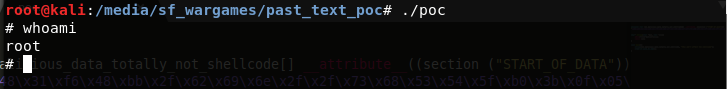
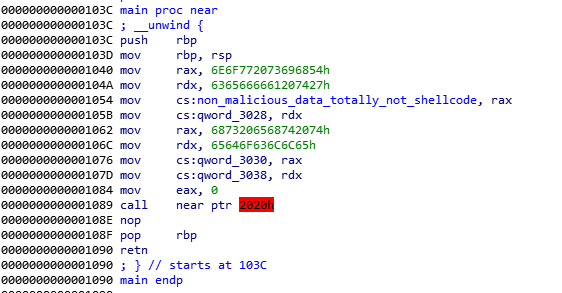
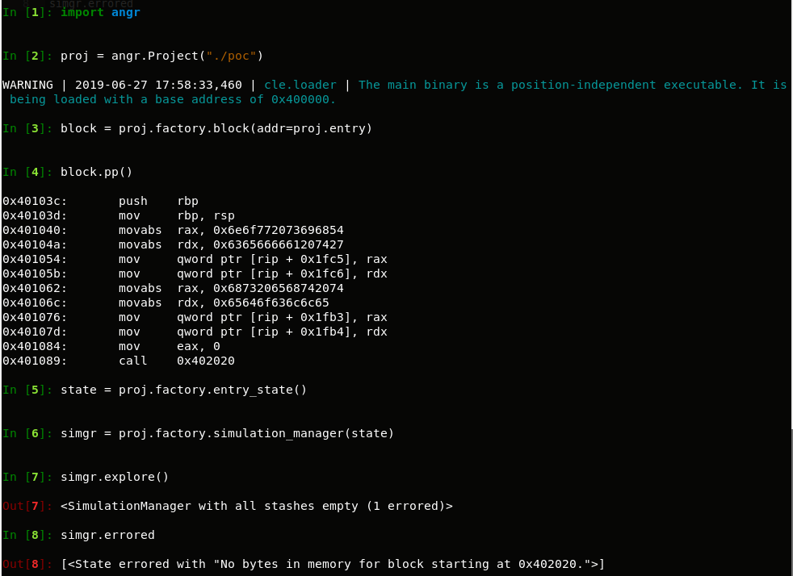

# Code past text

## General

I found some awkward behavior while researching linux memory layout, ELFs and related subjects.

Linux kernel ELF loaders seem to load an ELF file into memory in blocks of PAGESIZE.
By copying from the file in blocks of PAGESIZE, the loader isn't taking into account that a segment's filesize might not be aligned to PAGESIZE, meaning there might be unintentional data copied from the ELF file into the VMA of the segment.

What this means is that all the data from the file after the end of the segment (up to the alignment) will also be loaded into memory.

By using this behavior, we can use the last page of an RX segment as a neat place to hide code. Since reverse engineering tools don't take this (__undefined__?) behaviour into account, the code hidden there won't appear in the tool and a JMP/CALL/reference to it looks like access to unmapped memory.

There are several different ways we can do this.

One way would be to make sure the linker script will pad enough (in the file) after the text segment for our shellcode, overwrite the padding with our shellcode and JMP/CALL a hardcoded address (etext+OFFSET). You can also possibly make the padding be NOPs and JMP/CALL to etext.

Since shellcode in the file might look suspicious, maybe having the shellcode be used as data (a long XOR key or something) can make it look less suspicious.

To do this I played a bit with the linker script so that the shellcode will be a global buffer saved in the start of the data segment, and the data segment will be placed right after the text segment in the file.
I aligned the text to 0x1000 with 0s as padding, then added another 0x10 0s, and then placed the data segment. This effectively causes a DOUBLE-MAPPING of the start of the data to be also at the end of the text segment and also at the start of the data segment.

#### __Twitter: [@etbrem](https://twitter.com/etbrem)__

### IDA

### angr

## Tested on

__Note__ that generally the layout of the ELF depends on your linker and running your own compiled version of poc.c might not always work and can crash, but it's not difficult to play with the linker_script and make it work.

* Linux kali 4.19.0-kali4-amd64 #1 SMP Debian 4.19.28-2kali1 (2019-03-18) x86_64 GNU/Linux

## Resources

* <https://mcuoneclipse.com/2014/06/23/filling-unused-memory-with-the-gnu-linker>
* <https://web.archive.org/web/20160722090537/http://blog.hrbacek.info/2013/12/28/filling-unused-memory-area-using-gnu-linker-script>
* <https://www.exploit-db.com/exploits/42179>

## TODO
- Look for responsible linux ELF loader code
- Test on more kernels (Windows WSL?)
